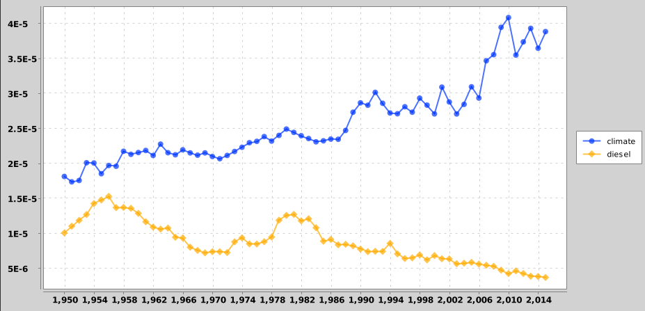

# What does the Ngram viewer do?
When you enter words into the Ngram Viewer, it displays a graph showing how those words have occurred in a corpus of books (e.g., "British English", "English Fiction", "French") over the selected years.

This shows trends in two ngrams from 1950 to 2015: "climate" (a 1-gram) and "diesel" (another 1-gram). The Y-axis shows: of all the unigrams contained in the sample of books written in English, what percentage of them are 
"climate" and "diesel". Here, you can see that use of the word "climate" started to rise in the late 90s, reached it's peak around 2010, and we talk more about the word "climate" in the books rather than the word "diesel".

# Corpora overview
The corpora has been collected from [Google's Ngram datasets](https://storage.googleapis.com/books/ngrams/books/datasetsv3.html). Below are descriptions of the corpora that can be searched with the Ngram Viewer.  

| Informal corpus name | Shorthand | Persistent identifier | Description |  
|----------------------|-----------|-----------------------|-------------|
| American English 2019|eng_us_2019|googlebooks-eng-us-20200217|	
| American English 2012|eng_us_2012|googlebooks-eng-us-20120701|Books predominantly in the English language that were published in the United States.
| American English 2009|eng_us_2009|googlebooks-eng-us-20090715|
# References:
- **Google Books Ngram Viewer**: Explore the official [Google Books Ngram Viewer](https://books.google.com/ngrams/)
- **Dataset Format and Organization**: Detailed information on the dataset format and organization can be found in this [doc](https://docs.google.com/document/d/14PWeoTkrnKk9H8_7CfVbdvuoFZ7jYivNTkBX2Hj7qLw/edit#heading=h.8nhntsyjxg92).
- **Usage Video**: Learn more about who uses a tool like this by watching this [video here](https://www.youtube.com/watch?v=InJDLLbK0zs).