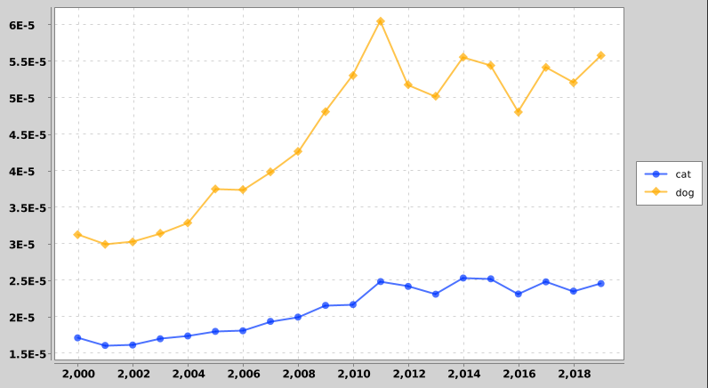

# What does the Ngram viewer do?
When you enter words into the Ngram Viewer, it displays a graph showing how those words have occurred in a corpus of books (e.g., "British English", "English Fiction", "French") over the selected years.

This shows trends in two ngrams from 2000 to 2018: "cat" (a 1-gram) and "dog" (another 1-gram). The Y-axis shows: of all the unigrams contained in the sample of books written in English, what percentage of them are 
"cat" or "dog". Here, you can see that use of the word "dog" started to rise in the late 2000s, reached it's peak around 2011, and the usage of the word "dog" always greater than the word "cat".

# Corpora overview
